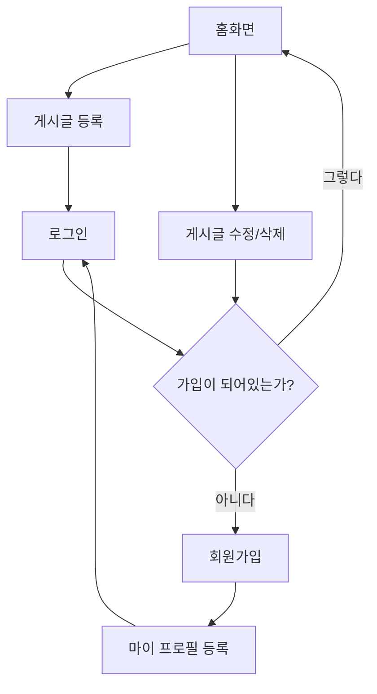

## 1. 머메이드란 ?

mermaid는 텍스트 코드를 통해 다이어 그램 또는 차트와 같이 데이터를 시각화 할 수 있도록 도와주는 자바스크립트 기반의 도구입니다. [공식 가이드](https://mermaid-js.github.io/mermaid/#/)를 참고한다면 쉽게 배울 수 있습니다.

## 2. 머메이드로 그릴 수 있는 것들

머메이드가 지원하는 차트와 다이어그램의 예시는 다음과 같습니다.

- **플로우 차트 (Flow  Chart)**
- **시퀀스 다이어그램 (Sequence Diagram)**
- **클래스 다이어그램 (Class Diagram)**
- **간트 차트 (Gantt Chart)**
- **파이 차트 (Pie Chart)**
- **고객 여정 다이어그램 (User Journey)**

이와 같이 머메이드는 다양한 종류의 차트와 다이어그램을 제공하지만 자주 이용하는 플로우차트에 대해서 알아보겠습니다.

## 3. 머메이드로 플로우차트 만들기

머메이드는 마크다운에 직접 사용할 수 있습니다. 


1. 먼저 마크다운 파일에 머메이드를 사용할 것임을 명시합니다. 다이어그램이나 차트가 들어갈 곳에 적어주면 좋습니다. 


2. 위 차트의 종류 중, 사용할 차트의 이름을 적어줍니다. 
    - `flowchart`
    - `sequenceDiagram`
    - `classDiagram`
    - `stateDiagram`
    - `erDiagram`
    - `journey`
    - `gantt`
    - `pie`
    - `requirementDiagram`
    

다이어그램 및 차트 별 사용방법은 위에서 언급한 라이브 에디터와 [**공식 홈페이지**](https://mermaid-js.github.io/mermaid/#/flowchart)를 통해 참고할 수 있습니다. 우리는 `flowchart`를 활용하여 라면을 끓이는 간단한 플로우차트를 만들어 보겠습니다.  


3. `flowchart`를 사용할 것임을 적어준 후, 플로우차트의 방향을 지정해 줍니다. 
- `TB`  위 → 아래
- `TD`  위 → 아래 (`TB`와 동일)
- `BT`  아래 → 위
- `RL`  오른쪽 → 왼쪽
- `LR`  왼쪽 → 오른쪽


4. 노드는 `flowchart TD` 아래 노드의 이름을 영문으로 적고, 원하는 텍스트를 `[ ]` 사이에 추가해 줍니다.  


**노드의 모양**은 아래와 같이 변경이 가능합니다. 

- `(텍스트)`: 둥근모서리 박스
- `([텍스트])` : 스타디움, 알약 모양
- `[[텍스트]]` : 각진 모양
- `[(텍스트)]` : 실린더 모양
- `((텍스트))` : 원
- `>텍스트]`  : 비대칭
- `{텍스트}` : 마름모
- `{{텍스트}}` : 육각형
- `[/텍스트/]` , `[\텍스트\]` : 평행사변형
- `[/텍스트\]` , `[\텍스트/]` : 사다리꼴

5. 다양한 선택지가 있다면 아래와 같이 선으로 연결 후 `|텍스트|` 안에 적어줍니다.   
    
    
노드간 **다양한 스타일의 선**으로 연결이 가능합니다. 기본 스타일 몇가지를 살펴보겠습니다.  ****

- `-->` 화살표
- `---` 실선
- `-.->` 점선 화살표
- `==>` 굵은 화살표

6. 이후 다음과 같이 노드간 연결해 줍니다. 동일한 노드를 가리키면 아래와 같이 자동 연결해 줍니다.

# 웹사이트 플로우차트 
```


# 웹사이트 플로우차트 


